# PDF Vision Text Extraction - System Architecture Flow

This diagram illustrates the complete workflow of the PDF Vision Text Extraction application, including the sophisticated OCR correction workflow that allows users to improve text extraction accuracy through a two-phase editing process.

```mermaid
graph TD
    %% User Interface Layer
    User["👤 User"] --> Upload["📤 Upload Zone<br/>(Drag & Drop)"]
    
    %% Frontend Components
    Upload --> FileValidation["✅ File Validation<br/>(PDF, Size Check)"]
    FileValidation --> PDFViewer["📄 PDF Viewer<br/>(react-pdf)"]
    FileValidation --> UploadAPI["🔗 Upload API Call<br/>(/api/upload)"]
    
    %% Backend Processing
    UploadAPI --> BackendValidation["🔍 Backend Validation<br/>(FastAPI)"]
    BackendValidation --> FileStorage["💾 Store PDF<br/>(uploads/ folder)"]
    FileStorage --> PDFProcessing["🖼️ PDF Processing<br/>(PyMuPDF)"]
    
    %% PDF Processing Chain
    PDFProcessing --> PageExtraction["📑 Extract Pages<br/>(as images)"]
    PageExtraction --> ImageStorage["🗂️ Store Images<br/>(extracted/ folder)"]
    ImageStorage --> AzureOpenAI["🤖 Azure OpenAI<br/>(GPT-4 Vision)"]
    
    %% AI Processing
    AzureOpenAI --> TextExtraction["📝 Text Extraction<br/>(with formatting)"]
    TextExtraction --> DatabaseStorage["🗄️ Database Storage<br/>(SQLite)"]
    
    %% Database Structure
    DatabaseStorage --> Documents["📊 Documents Table<br/>(id, filename, status)"]
    DatabaseStorage --> Pages["📋 Pages Table<br/>(id, doc_id, page_num)"]
    DatabaseStorage --> ExtractedText["📄 Extracted Text Table<br/>(id, page_id, content)"]
    
    %% Frontend Display
    DatabaseStorage --> TextAPI["🔗 Text API<br/>(/api/documents)"]
    TextAPI --> TextEditor["✏️ Text Editor<br/>(Material UI)"]
    
    %% Split Screen Interface
    PDFViewer --> SplitView["🔄 Split Screen View<br/>(react-resizable-panels)"]
    TextEditor --> SplitView
    
    %% User Actions
    SplitView --> Navigation["🔄 Page Navigation<br/>(synchronized)"]
    SplitView --> EditMode["✏️ Edit Mode<br/>(toggle editing)"]
    SplitView --> SearchText["🔍 Search Text<br/>(within extracted)"]
    SplitView --> ExportWord["📄 Export to Word<br/>(.docx download)"]
    
    %% OCR Correction Workflow
    SplitView --> CorrectionWorkflow["🔧 OCR Correction<br/>(workflow access)"]
    
    %% Phase 1: Document Upload and Comparison
    CorrectionWorkflow --> DocBUpload["📤 Upload Document B<br/>(Editable PDF)"]
    DocBUpload --> DocBValidation["✅ Document B Validation<br/>(text layer check)"]
    DocBValidation --> DocBStorage["💾 Store Document B<br/>(correction_inputs/)"]
    DocBStorage --> TextExtractionB["📝 Extract Text B<br/>(PyMuPDF layers)"]
    TextExtractionB --> EditablePDFDB["🗄️ EditablePDFText Table<br/>(text_content_by_page)"]
    
    %% Text Comparison
    EditablePDFDB --> TextComparison["🔍 Text Comparison<br/>(difflib algorithm)"]
    ExtractedText --> TextComparison
    TextComparison --> DifferenceEngine["⚡ Difference Engine<br/>(structured diffs)"]
    DifferenceEngine --> ComparisonView["📊 Comparison View<br/>(Phase 1 UI)"]
    
    %% Phase 1 User Interactions
    ComparisonView --> BulkOperations["🔄 Bulk Operations<br/>(Ignore/Replace All)"]
    ComparisonView --> IndividualEdits["✏️ Individual Edits<br/>(apply differences)"]
    ComparisonView --> SearchDiffs["🔍 Search in Diffs<br/>(highlighting)"]
    
    %% Phase 1 to Phase 2 Transition
    BulkOperations --> CorrectionStorage["💾 Store Corrections<br/>(CorrectedText Table)"]
    IndividualEdits --> CorrectionStorage
    CorrectionStorage --> FinalReview["📋 Final Review<br/>(Phase 2 UI)"]
    
    %% Phase 2: Final Review and Manual Editing
    FinalReview --> PDFPreview["📄 PDF Preview<br/>(original scanned)"]
    FinalReview --> ManualEditor["✏️ Manual Text Editor<br/>(corrected text)"]
    PDFPreview --> SyncNavigation["🔄 Synchronized Navigation<br/>(page alignment)"]
    ManualEditor --> SyncNavigation
    
    %% Phase 2 User Actions
    ManualEditor --> PageSave["💾 Save Page Changes<br/>(individual pages)"]
    ManualEditor --> UnsavedWarnings["⚠️ Unsaved Warnings<br/>(navigation protection)"]
    PageSave --> UpdateCorrectedDB["🗄️ Update CorrectedText<br/>(page-by-page)"]
    
    %% Finalization and Export
    UpdateCorrectedDB --> DocumentFinalization["✅ Document Finalization<br/>(complete workflow)"]
    DocumentFinalization --> EnhancedExport["📄 Enhanced Export<br/>(corrected text priority)"]
    
    %% Theme and UI
    SplitView --> ThemeToggle["🌙 Theme Toggle<br/>(Light/Dark)"]
    
    %% Export Processing
    ExportWord --> ExportAPI["🔗 Export API<br/>(/api/export)"]
    EnhancedExport --> ExportAPI
    ExportAPI --> WordGeneration["📄 Word Generation<br/>(python-docx)"]
    WordGeneration --> ExportStorage["💾 Export Storage<br/>(exports/ folder)"]
    ExportStorage --> DownloadFile["⬇️ Download File<br/>(.docx)"]
    
    %% Progress and State Management
    CorrectionWorkflow --> ProgressTracking["📊 Progress Tracking<br/>(completed pages)"]
    ComparisonView --> StateManagement["🔄 State Management<br/>(PDFContext)"]
    FinalReview --> CacheManagement["💾 Cache Management<br/>(comparison data)"]
    
    %% Error Handling
    TextComparison --> ErrorHandling["⚠️ Error Handling<br/>(validation & recovery)"]
    DocBUpload --> ErrorHandling
    ManualEditor --> ErrorHandling
    
    %% Styling
    classDef frontend fill:#e1f5fe,stroke:#01579b,stroke-width:2px
    classDef backend fill:#f3e5f5,stroke:#4a148c,stroke-width:2px
    classDef ai fill:#fff3e0,stroke:#e65100,stroke-width:2px
    classDef database fill:#e8f5e8,stroke:#1b5e20,stroke-width:2px
    classDef storage fill:#fff8e1,stroke:#f57f17,stroke-width:2px
    classDef correction fill:#f1f8e9,stroke:#33691e,stroke-width:2px
    
    class Upload,FileValidation,PDFViewer,TextEditor,SplitView,Navigation,EditMode,SearchText,ThemeToggle,ComparisonView,FinalReview,PDFPreview,ManualEditor frontend
    class UploadAPI,BackendValidation,PDFProcessing,TextAPI,ExportAPI,WordGeneration,TextComparison,DifferenceEngine backend
    class AzureOpenAI,TextExtraction ai
    class DatabaseStorage,Documents,Pages,ExtractedText,EditablePDFDB,CorrectionStorage,UpdateCorrectedDB database
    class FileStorage,ImageStorage,ExportStorage,DownloadFile,DocBStorage storage
    class CorrectionWorkflow,DocBUpload,BulkOperations,IndividualEdits,DocumentFinalization,EnhancedExport,ProgressTracking,StateManagement,CacheManagement correction
```

## Key Components

### Core Application Flow
- **Upload & Processing**: PDF upload → validation → page extraction → Azure OpenAI processing
- **Standard Viewing**: Split-screen PDF viewer with extracted text editing
- **Search & Navigation**: Page controls with synchronized scrolling
- **Export**: Word document generation with formatting preservation

### OCR Correction Workflow

#### Phase 1: Text Comparison and Bulk Correction
- **Document B Upload**: Users upload an editable PDF with existing text layers
- **Text Extraction**: PyMuPDF extracts text from Document B's layers
- **Intelligent Comparison**: difflib algorithm generates structured differences
- **Visual Diff Display**: Color-coded highlighting of differences between OCR and editable text
- **Bulk Operations**: 
  - "Ignore All" - Keep original OCR text
  - "Replace All" - Use Document B text
  - "Individual Changes" - Apply specific corrections
- **Progress Tracking**: Visual indicators for completed pages across the document

#### Phase 2: Final Review and Manual Editing
- **PDF Preview**: Original scanned PDF displayed alongside corrected text
- **Manual Editing**: Full text editing capabilities with real-time updates
- **Synchronized Navigation**: PDF pages and text editor automatically stay aligned
- **Save Management**: Page-by-page saving with unsaved changes warnings
- **Export Integration**: Direct Word export using corrected text

### Frontend Architecture (React + Material UI)
- **Upload Interface**: Drag-and-drop PDF upload with validation and progress tracking
- **PDF Viewer**: react-pdf component for rendering PDF pages
- **Text Editor**: Material UI TextField components with advanced editing features
- **Split View**: react-resizable-panels for synchronized dual-pane interface
- **Correction Components**: 
  - CorrectionDocumentUpload: Workflow setup and Document B upload
  - ComparisonView: Phase 1 text comparison and bulk corrections
  - FinalReviewView: Phase 2 manual editing with PDF preview
- **Navigation**: Seamless routing between workflow phases with state preservation

### Backend Architecture (FastAPI)
- **File Processing**: PDF validation, storage, and page extraction
- **API Endpoints**: RESTful APIs for upload, extraction, correction, and export
- **Database Management**: SQLite operations with specialized correction tables
- **Correction Services**:
  - EditablePDFService: Text extraction from Document B
  - TextComparisonService: Advanced diff generation using difflib
- **Export Enhancement**: Priority system for corrected text in Word generation

### Database Schema for Correction Workflow

#### Core Tables
- **Documents**: Original document metadata and status tracking
- **Pages**: Individual page information with extracted text
- **ExtractedText**: OCR results from Azure OpenAI processing

#### Correction Tables
- **EditablePDFText**: Document B text content stored per page in JSON format
- **CorrectedText**: Final corrected text per page after user editing

### AI Integration (Azure OpenAI)
- **GPT-4 Vision**: Processes PDF page images for initial text extraction
- **Text Enhancement**: Converts images to formatted text with structure preservation
- **Correction Integration**: Original OCR text serves as baseline for correction workflow

### Performance and User Experience

#### Caching Strategy
- **Comparison Data**: Cached per page to avoid re-computation of diffs
- **State Management**: React Context maintains workflow state across components
- **Memory Optimization**: Efficient handling of large PDFs with page-by-page processing

#### User Experience Features
- **Progress Indicators**: Real-time feedback for all operations
- **Error Handling**: Comprehensive error management with user-friendly messages
- **Responsive Design**: Material UI Grid system for mobile and desktop support
- **Theme Integration**: Light/dark mode support throughout entire workflow
- **Navigation Safety**: Unsaved changes warnings prevent data loss

### Data Flow Summary

1. **Standard Flow**: User uploads PDF → Backend extracts pages → Azure OpenAI processes → Text displayed in split-screen viewer
2. **Correction Flow**: User initiates correction → Uploads Document B → System compares texts → User applies corrections → Final review with PDF preview → Enhanced export with corrected text
3. **Export Enhancement**: System prioritizes corrected text when available, falls back to original OCR text for uncorrected pages

This architecture provides a comprehensive solution for PDF text extraction with sophisticated correction capabilities, ensuring high accuracy through user-guided refinement while maintaining excellent performance and user experience. 